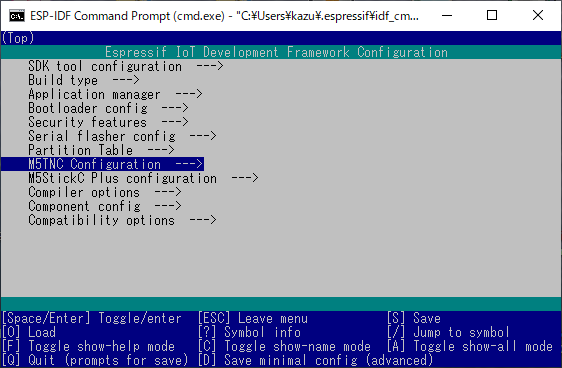

# M5TNC

M5TNC is a Terminal Node Controller (TNC) that is implemented on M5Stack products.

feature

* using M5Atom Lite/Matrix or M5StickC Plus for processing unit
* using small interface board (M5TNC HAT) connecting to a transceiver
* using ESP-IDF development framework to install TNC software
* support Bell202 1200bps AFSK
* implementing software modem, decoding capability same as TI TCM3105 modem chip
  * about 980 packets can be decoded against WA8LMF TNC TEST CD Track 1
* support KISS protocol only
* using USB serial for host connection and power supply
* support Wi-Fi connection (TCP and UDP)
* display received packet on the LCD (M5StickC Plus only)
* working with internal battery (M5StickC Plus only)
* planed: support FX.25 forward error correction

*Caution*: not supported normal **M5StickC**

## M5TNC HAT

M5TNC HAT is small interface board for connecting to a transceiver.

* size is 24x24mm (same as footprint of M5Atom)
* same PCB can support both M5Atom and M5StickC Plus
* small number of parts (1 transistor, 5 resistors, 3 capacitors, etc.)
* smallest TNC HAT in the world, may be :)

### Schematic

### CAD data

The schematic is [here](KiCAD/m5stack-atom-tnc.sch). (for KiCAD)  
The gerber data is [here](KiCAD/seeed-fx25tnc5-m5stack-panelize.zip). (for Seeed Fusion PCB)

### BOM list  

|Reference|Value|Description|Retail store in Japan|
|---|:---:|---|---|
|R1||option for VX8||
|R2|120k||[akizuki](https://akizukidenshi.com/catalog/g/gR-16124/)|
|R3|24k||[akizuki](https://akizukidenshi.com/catalog/g/gR-16243/)|
|R5|100R||[akizuki](https://akizukidenshi.com/catalog/g/gR-16101/)|
|R6|1k||[akizuki](https://akizukidenshi.com/catalog/g/gR-16102/)|
|R7|4.7k/22k|Yaesu: 4.7k, Standard/Icom: 22k, Kenwood: open|[akizuki](https://akizukidenshi.com/catalog/g/gR-16472/)/[akizuki](https://akizukidenshi.com/catalog/g/gR-16223/)|
|RV1|10k|Bourns 3362P|[akizuki](https://akizukidenshi.com/catalog/g/gP-03277/)|
|C1,C2,C3|0.1uF|Any ceramic capacitor, 2.54mm pitch|[akizuki](https://akizukidenshi.com/catalog/g/gP-04064/)|
|D1,D2|1SS178|Any small signal diode, e.g. 1N4148|[akizuki](https://akizukidenshi.com/catalog/g/gI-07783/)|
|D4|LED|3mm Round, indicate PTT|[akizuki](https://akizukidenshi.com/catalog/g/gI-04767/)|
|Q1|DTC143EL|Digital transistor|[akizuki](https://akizukidenshi.com/catalog/g/gI-12469/)|
|J1|5P|2.54mm pitch Pin Header, low-profile(9.54mm), for M5Atom|[akizuki](https://akizukidenshi.com/catalog/g/gC-00171/)|
|J2|4P|2.54mm pitch Pin Header, low-profile(9.54mm), for M5Atom|[akizuki](https://akizukidenshi.com/catalog/g/gC-00171/)|
|J3|MJ-8435|Marushin Electric, &phi;3.5mm jack|[akizuki](https://akizukidenshi.com/catalog/g/gC-09060/)|
|J4|MJ-2-34B0|Marushin Electric, &phi;2.5mm jack, also MJ-2-34A0 can be used|[momohara](https://www.mepc.jp/store/index.php?main_page=product_info&cPath=48&products_id=37843)|
|J5||Terminal for SP/MIC/PTT/GND||
|J6|8P|2.54mm pitch Pin Header, Right Angle, for M5StickC Plus|[akizuki](https://akizukidenshi.com/catalog/g/gC-01627/)|

R4 and D3 are missing number.  
J1/J2 or J6 is alternative.

### Mounting drawing

### Solder jumper

Solder jumper is needed depending on a transceiver.

|Manufacture|JP1|JP2|JP3|JP4|
|---|---|---|---|---|
|Standard/Icom/Yaesu|1-2|1-2|bridge|open|
|Kenwood|2-3|2-3|open|bridge|

for Standard/Icom/Yaesu

for Kenwood

## Installing the M5TNC software

* install [ESP-IDF](https://docs.espressif.com/projects/esp-idf/en/latest/esp32/), ESP-IDF v4.2 is needed
* download TNC software
  * `git clone https://github.com/amedes/M5TNC.git`
* configure TNC software
  * `idf.py menuconfig`
  * chose ether M5StickC Plus or M5Atom
  * 
* compile and install
  * `idf.py -p PORT -b 1500000 flash monitor`
* have fun!

## Instructions

# Known Issue

* M5TNC will hang up when a packet radio application opens the USB com port.

The auto-download circuit of M5Atom/M5StickC Plus is wrong.
So opening of the USB com port may reset the M5TNC and keep the reset state depending on the com port driver behavior.
There is no workaround to avoid this fault.  The following procedure may help you.

1. unplug the M5TNC from the computer
1. plug the M5TNC to the computer again and pray for luck
1. re-execute the packet radio application
1. repeat above procedure until good luck becomes...
